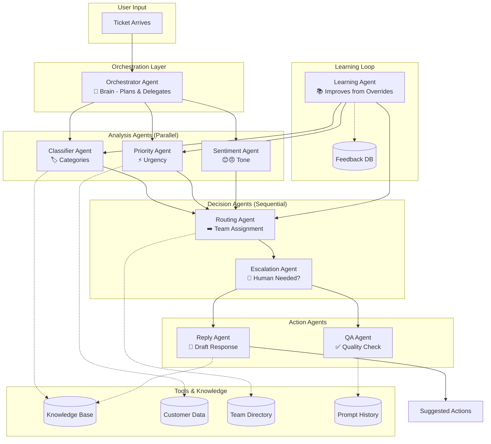
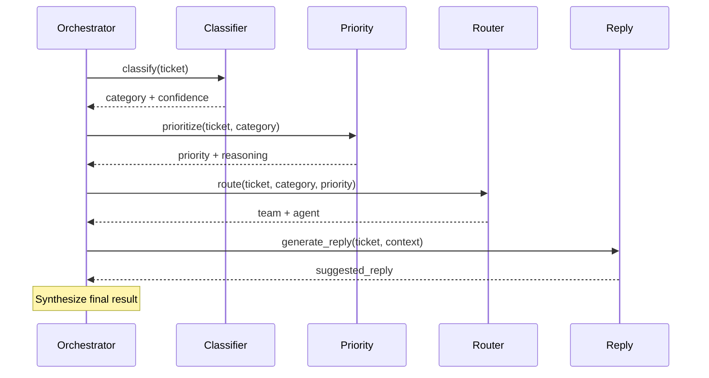
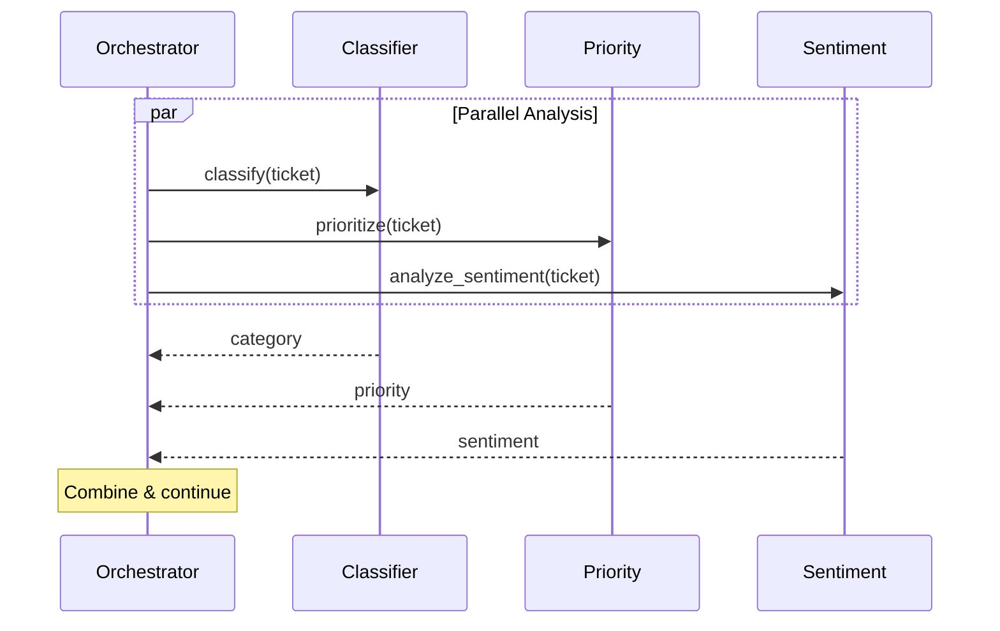
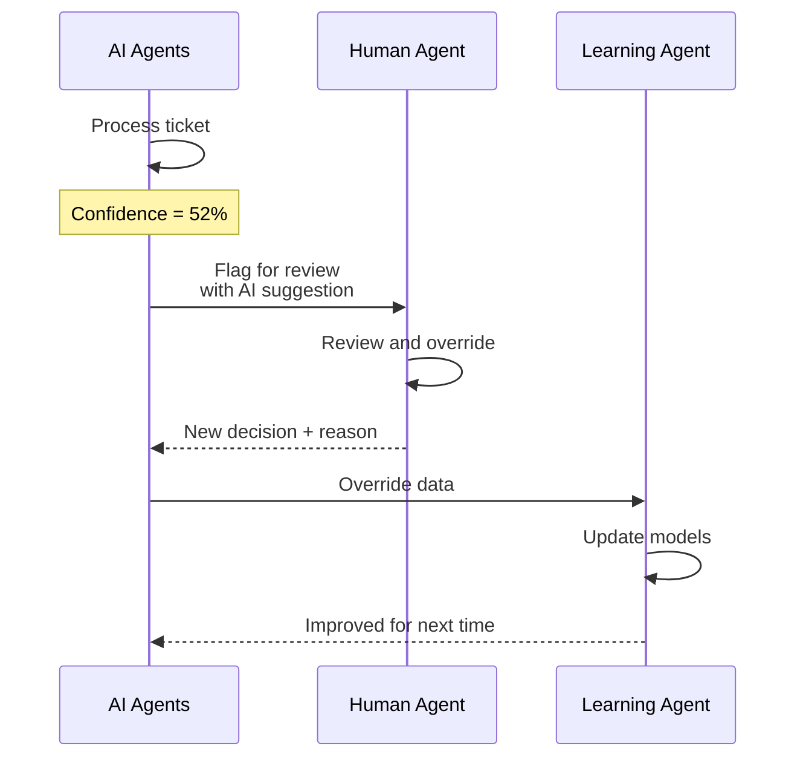

# AI Customer Ticket Triage - AI Agent Architecture Design

## 📌 Executive Summary

This document defines a **multi-AI-agent architecture** where each agent is an autonomous LLM-powered entity with specific roles, tools, and decision-making capabilities. Unlike the service-based architecture, these AI agents actively **reason, plan, and act** to triage tickets, rather than just processing data through pipelines.

**Agent Count:** 6 core AI agents + 2 specialized agents + 1 orchestrator agent

---

## 🎯 Core AI Agents Overview

| AI Agent | Role | Autonomy Level | Tools Access | LLM Preference |
|----------|------|----------------|--------------|-----------------|
| **Orchestrator Agent** | Workflow coordinator & task delegation | High (plans & delegates) | All agent APIs | GPT-4 (planning) |
| **Classifier Agent** | Categorizes ticket type & intent | Medium | Category DB, KB search | GPT-3.5-Turbo (fast) |
| **Priority Agent** | Determines urgency & business impact | Medium | Customer DB, SLA rules | GPT-4 (accuracy) |
| **Sentiment Agent** | Analyzes customer emotion & tone | Low (single task) | Sentiment lexicon | Claude (nuance) |
| **Routing Agent** | Assigns to right team/agent | High (load balancing) | Team skills DB, agent status | GPT-3.5-Turbo |
| **Reply Agent** | Generates suggested responses | Medium | KB articles, past replies | GPT-4-Turbo (quality) |
| **Escalation Agent** | Detects when human needed | High (risk assessment) | Confidence scores, history | Claude (safety) |
| **QA Agent** | Reviews other agents' work | Medium | Quality guidelines | GPT-4 (review) |
| **Learning Agent** | Improves from feedback | Continuous | Override database | Fine-tuned model |

---

## 🏗️ AI Agent Architecture Diagram



---

## 📋 Detailed AI Agent Specifications

### Agent 1: Orchestrator Agent (The Brain)

#### Role & Responsibility
The **CEO agent** that receives the ticket, plans the triage workflow, delegates tasks to specialized agents, and synthesizes results. Uses **ReAct pattern** (Reasoning + Acting).

#### Communication Pattern
- **Input:** Raw ticket (subject + message + metadata)
- **Output:** Complete triage decision + execution plan
- **Pattern:** Plan → Delegate → Aggregate → Decide

#### Decision-Making Process

```python
class OrchestratorAgent:
    def orchestrate(self, ticket: Ticket) -> TriageResult:
        # Step 1: Analyze ticket complexity
        complexity = self.assess_complexity(ticket)
        
        # Step 2: Create execution plan based on complexity
        if complexity == "simple":
            plan = self.simple_plan()  # Parallel analysis only
        elif complexity == "complex":
            plan = self.complex_plan()  # Sequential + validation
        else:  # critical
            plan = self.critical_plan()  # Multiple LLM consensus
            
        # Step 3: Delegate to specialized agents
        results = self.execute_plan(plan, ticket)
        
        # Step 4: Resolve conflicts between agents
        final = self.resolve_conflicts(results)
        
        # Step 5: Validate confidence
        if final.confidence < 0.7:
            final.needs_human_review = True
            
        return final
    
    def assess_complexity(self, ticket: Ticket) -> str:
        prompt = f"""
        Analyze this ticket complexity:
        Subject: {ticket.subject}
        Message: {ticket.message}
        
        Return JSON: {{"complexity": "simple|complex|critical", "reason": "..."}}
        """
        return self.llm.invoke(prompt)
```

#### Why Independent?
- **Single point of control:** Changes to workflow don't require updating all agents
- **Observability:** Complete trace of why decisions were made
- **Experimentation:** Can A/B test different orchestration strategies

#### Human Intervention: **Manual workflow override** (force specific path)

---

### Agent 2: Classifier Agent (The Labeler)

#### Role & Responsibility
Analyzes ticket content to determine the **category, subcategory, and intent**. Uses a combination of few-shot learning and semantic similarity.

#### Tools & Capabilities
```yaml
Tools:
  - category_database: Look up predefined categories
  - semantic_search: Find similar past tickets
  - keyword_extractor: Identify key terms

Capabilities:
  - Multi-label classification (ticket can have multiple categories)
  - Confidence scoring per category
  - Zero-shot classification for new categories
```

#### Input/Output Example

```json
// Input from Orchestrator
{
  "ticket_id": "T-1234",
  "subject": "Charged twice for premium plan",
  "message": "I was charged $49.99 twice this month. My bank shows two transactions.",
  "customer_tier": "premium"
}

// Output
{
  "primary_category": "billing",
  "secondary_categories": ["payment_processing", "subscription"],
  "subcategory": "duplicate_charge",
  "intent": "request_refund",
  "confidence": 0.94,
  "alternative_categories": [
    {"category": "technical", "confidence": 0.12},
    {"category": "account", "confidence": 0.08}
  ],
  "key_entities": ["$49.99", "premium plan", "duplicate"],
  "requires_human_verification": false
}
```

#### Decision Logic
```python
class ClassifierAgent:
    def classify(self, ticket: Ticket) -> Classification:
        # 1. Extract keywords
        keywords = self.extract_keywords(ticket.message)
        
        # 2. Search for similar tickets
        similar = self.semantic_search(ticket.message, top_k=5)
        
        # 3. Build few-shot prompt with examples
        examples = self.get_examples_for_categories(keywords)
        
        # 4. LLM classification
        llm_result = self.llm.classify(
            text=ticket.message,
            categories=self.category_db.list_all(),
            examples=examples
        )
        
        # 5. Apply business rules
        if "legal" in ticket.message.lower():
            llm_result.primary_category = "legal"
            llm_result.confidence = 0.99  # Override
        
        return llm_result
```

#### Why Agent (not simple ML)?
- **Understands nuance:** "My app is broken" vs "The app crashed when I tried to pay"
- **Adapts to new categories:** No retraining needed for new ticket types
- **Explanations:** Can explain WHY it chose a category

---

### Agent 3: Priority Agent (The Urgency Decider)

#### Role & Responsibility
Evaluates business impact, customer context, and issue severity to assign priority (Critical/High/Medium/Low).

#### Multi-Factor Decision Model

```python
class PriorityAgent:
    def determine_priority(self, ticket: Ticket, context: CustomerContext) -> Priority:
        factors = {
            "business_impact": self.assess_business_impact(ticket),
            "customer_health": self.get_customer_health(context),
            "issue_severity": self.assess_severity(ticket),
            "sla_risk": self.calculate_sla_risk(context),
            "financial_impact": self.detect_financial_urgency(ticket)
        }
        
        # Weighted scoring
        score = (
            factors["business_impact"] * 0.3 +
            factors["customer_health"] * 0.2 +
            factors["issue_severity"] * 0.25 +
            factors["sla_risk"] * 0.15 +
            factors["financial_impact"] * 0.1
        )
        
        priority_map = {
            0.8: "critical",
            0.6: "high", 
            0.4: "medium",
            0.0: "low"
        }
        
        priority = priority_map[score]
        
        # Generate explanation
        reasoning = self.explain_decision(factors)
        
        return Priority(level=priority, score=score, reasoning=reasoning)
    
    def assess_business_impact(self, ticket: Ticket) -> float:
        """Critical business impact detection"""
        critical_indicators = [
            "production down", "service outage", "data loss",
            "security breach", "cannot login", "payment failed"
        ]
        
        for indicator in critical_indicators:
            if indicator in ticket.message.lower():
                return 1.0
        return 0.5
```

#### Example Output
```json
{
  "priority": "high",
  "score": 0.78,
  "reasoning": "Customer is premium tier ($500/month) reporting duplicate charge. Financial impact moderate. Sentiment frustrated (75% angry keywords). Historical response time 45min, currently at 30min.",
  "escalation_deadline": "2024-05-09T15:30:00Z",
  "suggested_sla": "2 hours"
}
```

---

### Agent 4: Sentiment Agent (The Emotion Reader)

#### Role & Responsibility
Analyzes customer's emotional state and predicts churn risk. Specialized for nuanced emotional understanding.

#### Why Separate from Classifier?
- **Different LLM strength:** Claude is better at emotional nuance than GPT-4
- **Different latency needs:** Sentiment can be slightly slower
- **Different output structure:** Sentiment needs richer emotional data

#### Capabilities
```python
class SentimentAgent:
    def analyze(self, message: str, history: List[Message]) -> SentimentAnalysis:
        # Multi-dimensional analysis
        dimensions = {
            "anger": self.detect_anger(message),
            "frustration": self.detect_frustration(message),
            "urgency": self.detect_urgency(message),
            "confusion": self.detect_confusion(message),
            "politeness": self.detect_politeness(message)
        }
        
        # Track sentiment over time
        sentiment_trend = self.get_trend(history) if history else None
        
        # Churn prediction
        churn_risk = self.predict_churn(dimensions, sentiment_trend)
        
        return {
            "primary_emotion": "frustrated",
            "dimensions": dimensions,
            "sentiment_trend": sentiment_trend,
            "churn_risk": 0.65,  # 65% likely to churn if not resolved
            "urgency_override": True,  # Frustrated customers need faster response
            "suggested_tone": "empathetic",
            "escalation_recommended": churn_risk > 0.7
        }
```

---

### Agent 5: Routing Agent (The Dispatcher)

#### Role & Responsibility
Determines the best team or agent based on required skills, current workload, and availability.

#### Smart Routing Algorithm

```python
class RoutingAgent:
    def route(self, 
              ticket: Ticket, 
              classification: Classification,
              teams: List[Team]) -> RoutingDecision:
        
        # Step 1: Identify required skills from classification
        required_skills = self.extract_skills(classification)
        
        # Step 2: Score each team's suitability
        for team in teams:
            team.score = self.calculate_fit_score(
                team_skills=team.skills,
                required_skills=required_skills,
                current_load=team.open_tickets,
                expertise_level=team.expertise[classification.primary_category]
            )
        
        # Step 3: Check for specialized routing
        if ticket.customer_tier == "enterprise":
            best_team = self.find_enterprise_team(teams)
        elif classification.primary_category == "security":
            best_team = self.find_security_team(teams)
        else:
            best_team = max(teams, key=lambda t: t.score)
        
        # Step 4: Find best agent within team
        best_agent = self.find_best_agent(
            team=best_team,
            required_skills=required_skills,
            current_load=True
        )
        
        return RoutingDecision(
            assigned_team=best_team.name,
            assigned_agent=best_agent.id if best_agent else None,
            reason=f"Team {best_team.name} has best skill match ({best_team.score:.2f})",
            estimated_wait_time=self.calculate_wait_time(best_team)
        )
```

#### Load Balancing Intelligence
```python
def calculate_fit_score(self, team, required_skills, current_load):
    # 60% skill match, 40% load balancing
    skill_score = self.skill_match_percentage(team.skills, required_skills)
    load_score = 1 - (current_load / team.max_capacity)
    
    # Weight based on urgency
    if required_skills.urgency == "high":
        weight_skill = 0.7  # Skill matters more for urgent
        weight_load = 0.3
    else:
        weight_skill = 0.5
        weight_load = 0.5
    
    return (skill_score * weight_skill) + (load_score * weight_load)
```

---

### Agent 6: Reply Agent (The Writer)

#### Role & Responsibility
Generates contextually appropriate, personalized draft responses using RAG (Retrieval-Augmented Generation).

#### Advanced Generation Pipeline

```python
class ReplyAgent:
    def generate_reply(self, 
                       ticket: Ticket, 
                       context: TriageContext) -> SuggestedReply:
        
        # 1. Retrieve relevant knowledge base articles
        kb_articles = self.vector_search.search(
            query=ticket.message,
            filters={"category": context.category},
            top_k=3
        )
        
        # 2. Find similar past successful replies
        similar_replies = self.find_similar_resolved_tickets(
            category=context.category,
            sentiment=ticket.sentiment
        )
        
        # 3. Build generation prompt
        prompt = self.build_reply_prompt(
            ticket=ticket,
            kb_articles=kb_articles,
            examples=similar_replies,
            tone=context.suggested_tone
        )
        
        # 4. Generate multiple candidates
        candidates = [
            self.llm.generate(prompt, temperature=0.7),
            self.llm.generate(prompt, temperature=0.3),  # More conservative
            self.llm.generate(prompt, style="concise")
        ]
        
        # 5. Score and select best
        best = self.score_replies(candidates)  # By relevance, length, tone
        
        # 6. Add personalization
        best.text = self.personalize(best.text, ticket.customer_name)
        
        return SuggestedReply(
            text=best.text,
            confidence=best.score,
            alternative_replies=candidates[1:],
            kb_articles_used=[a.id for a in kb_articles]
        )
```

#### Example Output
```json
{
  "suggested_reply": "Hi Taylor,\n\nI see you were charged twice for your Premium plan. I've initiated a refund for the duplicate $49.99 charge. You should see it back in 3-5 business days.\n\nReally sorry for the confusion here!\n\nBest,\nAlex",
  "confidence": 0.92,
  "tone": "empathetic + action-oriented",
  "personalization_tokens": ["Taylor", "Premium plan", "$49.99"],
  "kb_articles_used": ["KB-123", "KB-456"],
  "alternative_replies": ["[More formal version...]", "[Shorter version...]"]
}
```

---

### Agent 7: Escalation Agent (The Safety Net)

#### Role & Responsibility
Determines if human intervention is needed and when to escalate. Acts as a **guardrail agent** that can override other agents.

#### Escalation Triggers

```python
class EscalationAgent:
    def should_escalate(self, 
                       ticket: Ticket, 
                       analysis: TriageAnalysis) -> EscalationDecision:
        
        triggers = []
        
        # Trigger 1: Low confidence across agents
        if analysis.confidence < 0.7:
            triggers.append("low_ai_confidence")
        
        # Trigger 2: High churn risk
        if analysis.sentiment.churn_risk > 0.7:
            triggers.append("high_churn_risk")
        
        # Trigger 3: Legal/financial sensitivity
        sensitive_keywords = ["legal", "attorney", "lawsuit", "chargeback"]
        if any(kw in ticket.message.lower() for kw in sensitive_keywords):
            triggers.append("legal_implication")
        
        # Trigger 4: VIP customer
        if ticket.customer_tier == "enterprise" and analysis.priority == "critical":
            triggers.append("vip_escalation")
        
        # Trigger 5: Repeated issue
        if ticket.customer_repeat_count > 3:
            triggers.append("recurring_issue")
        
        # Trigger 6: Emotional distress
        if analysis.sentiment.dimensions.anger > 0.8:
            triggers.append("customer_distressed")
        
        # Decision
        if triggers:
            return EscalationDecision(
                needs_escalation=True,
                triggers=triggers,
                suggested_level=self.get_escalation_level(triggers),
                assign_to_manager="management" in triggers,
                priority_override=True
            )
        
        return EscalationDecision(needs_escalation=False)
```

---

### Agent 8: QA Agent (The Reviewer)

#### Role & Responsibility
Reviews other agents' work before sending to customer (when confidence is medium). Acts as a **second opinion**.

#### Multi-Agent Consensus Pattern

```python
class QAAgent:
    def review(self, 
               original_ticket: Ticket,
               triage_result: TriageResult) -> QAReview:
        
        # 1. Check classification against actual content
        classification_review = self.verify_classification(
            original_ticket, triage_result.category
        )
        
        # 2. Check reply for accuracy and tone
        reply_review = self.check_reply_quality(
            triage_result.suggested_reply,
            original_ticket
        )
        
        # 3. Check for hallucinations
        hallucination_check = self.detect_hallucinations(
            triage_result.suggested_reply,
            original_ticket
        )
        
        # 4. Overall score
        total_score = (
            classification_review.accuracy * 0.3 +
            reply_review.relevance * 0.4 +
            reply_review.tone_match * 0.2 +
            (1 - hallucination_check.risk) * 0.1
        )
        
        if total_score > 0.8:
            decision = "approve"
        elif total_score > 0.6:
            decision = "flag_for_human_review"
            human_feedback = self.generate_feedback(reply_review)
        else:
            decision = "reject_regenerate"
        
        return QAReview(score=total_score, decision=decision, feedback=...)
```

---

### Agent 9: Learning Agent (The Improver)

#### Role & Responsibility
Continuously improves other agents by learning from human overrides and feedback.

#### Feedback Loop Architecture

```python
class LearningAgent:
    def learn_from_override(self, 
                           original_ticket: Ticket,
                           ai_decision: TriageResult,
                           human_decision: TriageResult):
        
        # 1. Identify discrepancy
        if ai_decision.category != human_decision.category:
            self.update_classifier_rules(original_ticket, human_decision.category)
            
        # 2. Update prompt examples (few-shot learning)
        self.add_to_few_shot_examples(
            ticket=original_ticket,
            correct_output=human_decision
        )
        
        # 3. Fine-tune embedding for vector search
        self.update_embeddings(original_ticket, human_decision.category)
        
        # 4. Log for future fine-tuning
        self.store_training_sample(original_ticket, human_decision)
        
        # 5. Trigger retraining if enough samples collected
        if self.samples_since_last_retrain > 1000:
            self.schedule_model_retraining()
    
    def weekly_retraining(self):
        """Weekly fine-tuning based on accumulated overrides"""
        # Extract all override pairs from last week
        overrides = self.fetch_overrides(days=7)
        
        # Create training dataset
        dataset = self.prepare_training_data(overrides)
        
        # Fine-tune smaller models (Classifier, Priority)
        self.fine_tune_category_model(dataset)
        self.fine_tune_priority_model(dataset)
        
        # Update prompt templates
        self.update_prompts_based_on_patterns(overrides)
```

---

## 🔄 Agent Communication Patterns

### Pattern 1: Orchestrator-Led Serial Processing



### Pattern 2: Parallel Processing (Fast Path)



### Pattern 3: Human-in-the-Loop



---

## 🛠️ Tools Each Agent Can Use

| Agent | Tools/APIs | When Used |
|-------|------------|-----------|
| **Orchestrator** | All agent APIs, Workflow engine | Planning & coordination |
| **Classifier** | Category DB, KB search, Keyword extractor | Understanding ticket |
| **Priority** | Customer DB, SLA calculator, Business rules | Urgency assessment |
| **Sentiment** | Sentiment lexicon, Emotion models | Emotional analysis |
| **Router** | Team DB, Load balancer, Skills matcher | Assignment |
| **Reply** | Vector DB, Template library, Grammar checker | Response generation |
| **Escalation** | Risk models, Compliance DB | Safety decisions |
| **QA** | Quality guidelines, Hallucination detector | Verification |
| **Learning** | Feedback DB, Training pipeline | Improvement |

---

## 🎭 Agent Collaboration Scenarios

### Scenario 1: Simple Billing Ticket

```
Input: "I was charged twice"

Orchestrator: "Simple billing issue. Running fast path."

Agents involved:
1. Classifier → "billing" (0.95 confidence)
2. Priority → "high" (financial impact)
3. Router → "finance-support" (exact match)
4. Reply → "We'll refund duplicate" (from template)

Time: ~2 seconds
Human intervention: Not required (confidence 0.92)
```

### Scenario 2: Complex Technical Issue

```
Input: "API returns 500 error when I call /payments with webhook"

Orchestrator: "Complex technical. Need full pipeline with verification."

Agents involved:
1. Classifier → "technical" + "api" subcategory
2. Priority → "critical" (production impact)
3. Sentiment → "frustrated + urgent"
4. Router → "technical-support" + specific API team
5. Reply → Searches KB for 500 error fixes
6. QA → Reviews reply (score 0.72 → flag for review)
7. Escalation → Recommends human review

Time: ~5 seconds
Human intervention: QA flagged for review
```

### Scenario 3: Edge Case (Low Confidence)

```
Input: Very vague: "It's not working. You know what I mean."

Orchestrator: "Ambiguous input. All agents low confidence."

Classifier: 0.45 confidence
Priority: 0.38 confidence
Sentiment: "confused + passive"

Escalation Agent triggers:
- "low_ai_confidence"
- "insufficient_information"

Decision: Route directly to human support
No AI reply generated

Human intervention: YES - immediate escalation
```

---

## 📊 When Each Agent is Used

| Scenario | Classifier | Priority | Sentiment | Router | Reply | Escalation | QA | Learning |
|----------|------------|----------|-----------|--------|-------|------------|----|-----------|
| New ticket (auto) | ✅ | ✅ | ✅ | ✅ | ✅ | ✅ | ❌ | ❌ |
| Agent override | ✅ | ✅ | ❌ | ✅ | ✅ | ❌ | ✅ | ✅ |
| Quality review | ❌ | ❌ | ❌ | ❌ | ✅ | ❌ | ✅ | ❌ |
| Batch processing | ✅ | ✅ | ❌ | ✅ | ❌ | ✅ | ❌ | ❌ |
| Training/learning | ❌ | ❌ | ❌ | ❌ | ❌ | ❌ | ❌ | ✅ |

---

## 🧠 Agent Decision Autonomy Matrix

| Decision Type | Agent Makes | Human Reviews | Human Overrides |
|---------------|-------------|---------------|-----------------|
| Category (confidence >0.9) | ✅ | ❌ | ✅ |
| Category (confidence 0.7-0.9) | ✅ | ✅ (QA) | ✅ |
| Category (confidence <0.7) | ❌ | ✅ | ✅ |
| Priority > Medium | ✅ | ❌ | ✅ |
| Priority Critical | ✅ | ✅ (Escalation) | ✅ |
| Team routing (standard) | ✅ | ❌ | ✅ |
| Team routing (unusual) | ✅ | ✅ | ✅ |
| Reply generation | ✅ | ❌ (auto-send) | ✅ |
| Reply (legal/financial) | ❌ | ✅ | ✅ |
| Escalation decision | ✅ | ❌ | ✅ |

---

## 🚀 Scaling the AI Agent System

### Horizontal Scaling
```yaml
Each agent can run multiple instances:
  - Orchestrator: 3 instances (active-passive with leader election)
  - Classifier: 10 instances (stateless, round-robin)
  - Priority: 5 instances
  - Reply: 20 instances (most compute-heavy)
  
Load distribution:
  - Same ticket processed by same agent instance (affinity)
  - Different tickets distributed across instances
```

### Performance Targets
| Agent | Target Latency | Max Concurrency | Cache Strategy |
|-------|---------------|-----------------|----------------|
| Orchestrator | 100ms | 100 | Session cache |
| Classifier | 800ms | 500 | Semantic cache |
| Priority | 600ms | 500 | Rule cache |
| Sentiment | 400ms | 200 | - |
| Router | 200ms | 1000 | Team state cache |
| Reply | 1500ms | 300 | Template cache |
| Escalation | 100ms | 1000 | Decision cache |
| QA | 800ms | 100 | - |

---

## ✅ Why This Architecture Makes Sense

### For Real-World Usage
1. **Handles ambiguity:** LLM agents understand vague tickets better than rules
2. **Adapts quickly:** Change prompts, not code, to improve accuracy
3. **Explains decisions:** Each agent provides reasoning for audits
4. **Cost-effective:** Cheap GPT-3.5 for simple tasks, GPT-4 only when needed

### For Scalability
1. **Independent scaling:** Heavy agents (Reply) scale separately from light agents (Router)
2. **Fault tolerance:** One agent failing doesn't stop the whole pipeline
3. **A/B testing:** Run multiple agent versions simultaneously

### For Maintenance
1. **Separate prompts:** Update one agent without breaking others
2. **Separate models:** Swap GPT-4 for Claude in Sentiment only
3. **Gradual rollout:** Test new agent version on 5% of tickets

### For Portfolio Value
1. **Shows advanced AI architecture** (not just API calls)
2. **Demonstrates agentic patterns** (ReAct, RAG, multi-agent)
3. **Production-ready patterns** (circuit breakers, fallbacks, caching)

---

## 📝 Summary Table

| Aspect | Traditional Service | AI Agent Architecture |
|--------|---------------------|----------------------|
| Decision logic | Hardcoded rules | LLM reasoning |
| Adaptability | Change code | Change prompts |
| Explainability | Logs only | Natural language reasoning |
| Handling edge cases | Requires code update | Handles with low confidence flag |
| Cost | Compute only | LLM tokens + compute |
| Latency | 50-200ms | 500-2000ms |
| Accuracy on seen cases | 95%+ | 90-95% |
| Accuracy on novel cases | 50-60% | 75-85% |

**Verdict:** AI agents excel at understanding, nuance, and adaptation. Traditional services excel at speed and deterministic accuracy. **Hybrid approach** is best: AI agents for analysis, services for execution.