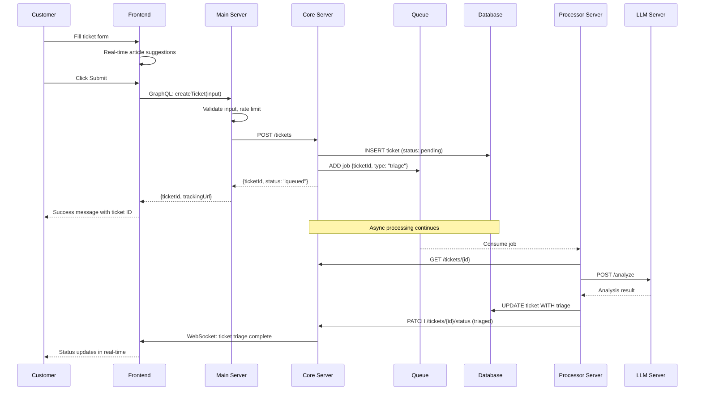
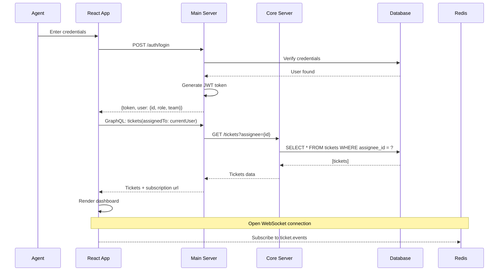
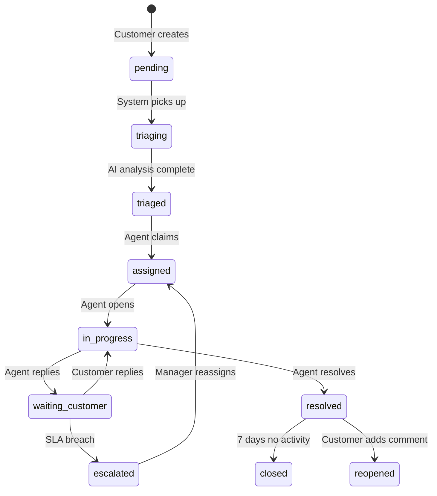
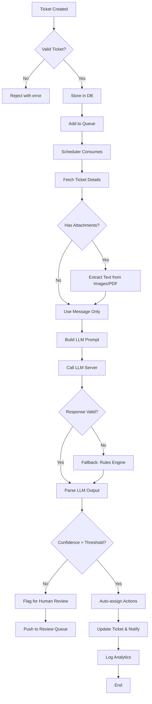
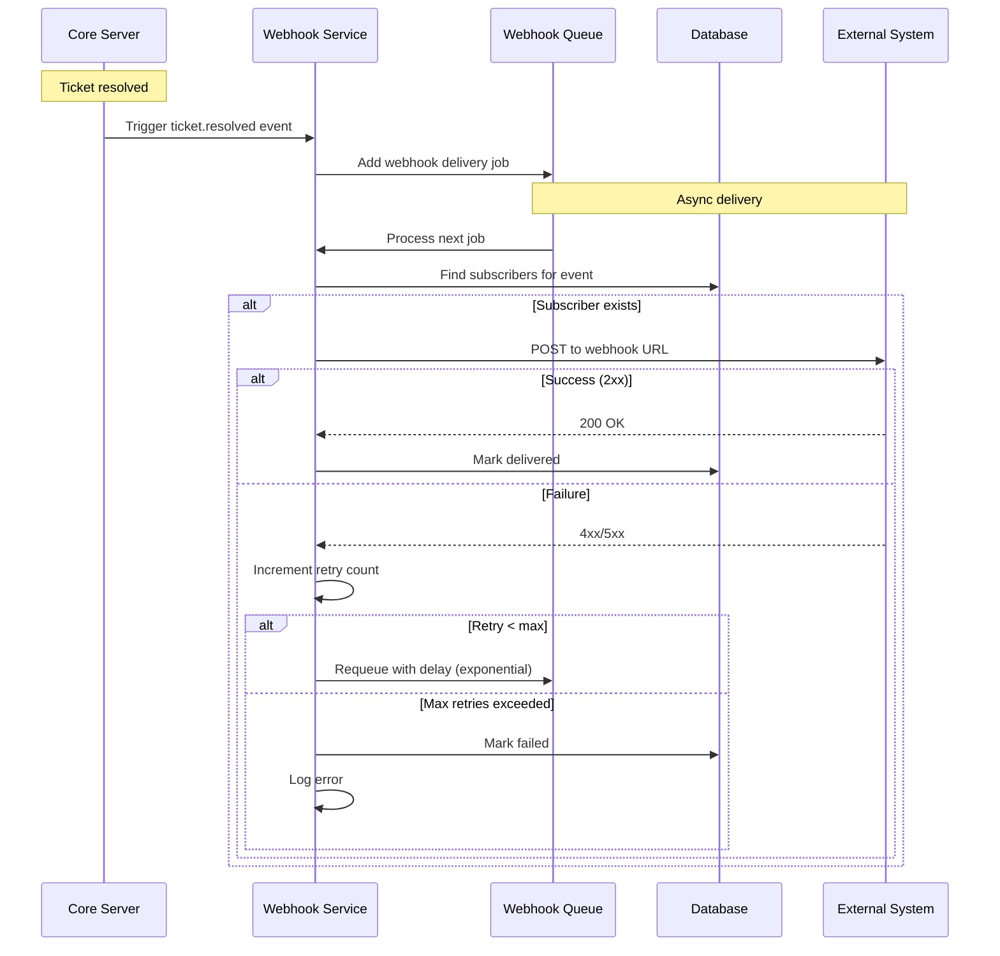

# AI Customer Ticket Triage - User & System Flows

## Document Overview
This document defines all user journeys and system interaction flows in the AI Customer Ticket Triage system. Each flow includes step-by-step sequences, system interactions, edge cases, and error handling.

---

## 👤 Customer Flows

### Flow 1: Submit New Ticket (Complete Journey)

#### User Steps
```
1. Customer visits support portal (React app)
2. Clicks "Submit Ticket" button
3. Fills form:
   - Subject (required)
   - Description (required)
   - Priority (optional, default medium)
   - Attachments (optional)
4. System shows real-time article suggestions as they type
5. Customer clicks "Submit"
6. System shows success message with ticket ID
7. Customer receives confirmation email
8. Customer can track status via provided link
```

#### System Sequence


#### Edge Cases & Error Handling

| Scenario | System Response |
|----------|-----------------|
| Duplicate ticket | Detect similar subject+message, show "Did you mean this existing ticket?" |
| Empty required fields | Client-side validation, server-side revalidation |
| Offline submission | Store locally, retry when online (PWA) |
| LLM timeout | Fallback to rules-based analysis, queue for retry |
| Rate limit exceeded | Return 429, show "Please wait 30 seconds" |

---

### Flow 2: Customer Tracks Ticket Status

#### User Steps
```
1. Customer clicks tracking link from email
2. Views public ticket status page (no login required)
3. Sees:
   - Current status (pending/in-progress/resolved)
   - Timeline of updates
   - Estimated response time
   - Assigned team (optional)
4. Customer can add comment or close ticket
```

#### System Flow
```typescript
// GET /public/tickets/:token
async getTicketByToken(token: string) {
  // Decrypt token to get ticketId
  const ticketId = decryptToken(token);
  
  // Fetch ticket (exclude internal notes)
  const ticket = await prisma.ticket.findUnique({
    where: { id: ticketId },
    select: {
      id: true,
      subject: true,
      status: true,
      createdAt: true,
      updatedAt: true,
      messages: {
        where: { isInternal: false },
        orderBy: { createdAt: 'asc' }
      }
    }
  });
  
  // Rate limit by IP address
  await rateLimit(request.ip);
  
  return ticket;
}
```

---

### Flow 3: Customer Adds Comment to Existing Ticket

```
Customer → Public page → "Add Comment" → Type message → Submit
    ↓
System validates token and ticket status
    ↓
If ticket is resolved → Option to reopen
If ticket closed → Create new ticket instead
    ↓
Store comment, update ticket updatedAt
    ↓
Trigger webhook: ticket.updated
    ↓
Notify assigned agent (email/Slack)
    ↓
Show success message to customer
```

---

## 👨‍💼 Agent Flows

### Flow 4: Agent Login & Dashboard Load

#### User Steps
```
1. Agent navigates to dashboard
2. Enters email + password (or SSO)
3. MFA if enabled (optional)
4. System loads:
   - Assigned tickets (priority sorted)
   - Team queue (if manager)
   - Personal metrics
   - Global alerts
5. Agent sees real-time updates via WebSocket
```

#### System Sequence


#### Dashboard Components
```
┌─────────────────────────────────────────────────────────────┐
│  Header: Welcome, Alex | Team: Finance | Today's tickets: 12│
├─────────────────────────────────────────────────────────────┤
│  ┌─────────────┬─────────────┬─────────────┬─────────────┐ │
│  │ High (3)    │ Medium (7)  │ Low (2)     │ Resolved    │ │
│  │ 🔴 Urgent   │ 🟡 Normal   │ 🟢 Low prio  │ (15 today)  │ │
│  └─────────────┴─────────────┴─────────────┴─────────────┘ │
├─────────────────────────────────────────────────────────────┤
│  Ticket List:                                               │
│  ┌───────────────────────────────────────────────────────┐ │
│  │ [#1234] Duplicate charge - Taylor - 5min ago [AI 94%] │ │
│  │ [#1235] Login error - Jordan - 15min ago [AI 67%]     │ │
│  │ [#1236] Cancel subscription - Alex - 1hr ago [AI 88%] │ │
│  └───────────────────────────────────────────────────────┘ │
├─────────────────────────────────────────────────────────────┤
│  My Metrics: Response time: 4.2min | Satisfaction: 4.8/5   │
└─────────────────────────────────────────────────────────────┘
```

---

### Flow 5: Agent Processes a Ticket

#### Detailed Step-by-Step

```
STEP 1: Agent opens ticket
───────────────────────────────────────
Alex clicks on ticket #1234 "Duplicate charge"

System loads:
├── Customer info: Taylor, Silver tier, 5 previous tickets
├── Ticket details + full conversation
├── AI analysis panel
│   ├── Category: billing (94% confidence)
│   ├── Priority: high
│   ├── Sentiment: frustrated
│   ├── Suggested team: finance-support
│   └── Suggested reply: "We've identified duplicate..."
├── Customer's recent tickets sidebar
└── Knowledge base suggestions (right panel)


STEP 2: Agent reviews AI analysis
───────────────────────────────────────
Alex sees:
├── Category is correct → keeps it
├── Suggested reply looks accurate → clicks "Use"
├── Edits slightly: adds "Refund initiated. 3-5 business days."


STEP 3: Agent takes action
───────────────────────────────────────
Options available:
├── Send reply and resolve
├── Send reply and keep open
├── Assign to different team → selects "technical-support"
├── Change priority → downgrades to medium
├── Add internal note
└── Escalate to manager


STEP 4: Agent sends response
───────────────────────────────────────
Alex clicks "Send Reply"

System:
├── Stores reply in database
├── Updates ticket status to "resolved"
├── Sends email to customer
├── Logs resolution time: 3 minutes
├── Updates agent metrics
└── Triggers satisfaction survey


STEP 5: Auto-next
───────────────────────────────────────
System automatically opens next high-priority ticket
Or shows "No more tickets" with summary
```

#### State Transitions


---

### Flow 6: Agent Overrides AI Decision

**Scenario:** AI incorrectly categorized as "technical" but should be "billing"

```
1. Alex opens ticket #1234
2. Sees AI category: technical (51% confidence)
3. Alex disagrees → clicks "Edit" next to category
4. Dropdown shows all categories
5. Alex selects "billing"
6. Modal appears:

   ┌─────────────────────────────────────────────┐
   │ Override Reason (required)                  │
   │ ⚠️ This helps us improve AI accuracy        │
   │                                             │
   │ Reason: Customer mentions "charge" and      │
   │         "payment" multiple times            │
   │                                             │
   │ [Cancel]  [Save Override]                   │
   └─────────────────────────────────────────────┘

7. Alex clicks "Save Override"
8. System:
   - Updates category to "billing"
   - Stores override in `override_history`
   - Increments override_counter for this ticket type
   - Triggers analytics event
9. UI shows: "Saved. AI will learn from this"

10. Future similar tickets have higher confidence
    for billing category
```

**Override Analytics:**
```sql
-- Track override patterns
INSERT INTO override_history VALUES (
  ticket_id: 'T-1234',
  field: 'category',
  original_value: 'technical',
  new_value: 'billing',
  reason: 'Customer mentions charge and payment',
  agent_id: 'agent_456',
  timestamp: NOW()
);

-- Update aggregate table
UPDATE category_accuracy 
SET override_count = override_count + 1,
    accuracy = (correct_count / total_count)
WHERE category = 'technical';
```

---

## 👔 Manager Flows

### Flow 7: Manager Reviews Team Performance

```
Step 1: Manager Jamie logs in
    ↓
Dashboard loads with team metrics:
├── Team size: 8 agents
├── Today's tickets: 142 (↑15% vs yesterday)
├── Avg response time: 6.2min (SLA: 4hrs ✅)
├── AI accuracy: 89% (target: 85% ✅)
├── Agent workload:
│   ├── Alex: 8 tickets (⚡ at capacity)
│   ├── Jordan: 3 tickets (available)
│   └── Taylor: 12 tickets (⚠️ overloaded)
│
├── SLA at risk: 2 tickets (warning)
└── High priority backlog: 4 tickets

Step 2: Click on "Alex" to see detailed metrics
    ↓
Agent Performance:
├── Tickets resolved today: 24
├── Avg handling time: 4.2min
├── CSAT score: 4.9/5
├── Override rate: 8% (below team avg 12%)
├── Busy hours: 10-11AM, 2-4PM
└── Recent overrides: [list]

Step 3: Identify bottleneck
    ↓
Jamie sees "technical-support" team has 20 tickets,
"finance-support" has 5 tickets

Action: Click "Balance Workload"
    ↓
System suggests moving 3 technical tickets to finance
(requires category override)

Step 4: Apply changes
    ↓
Jamie approves reassignment
Tickets moved
Agents notified via Slack
```

---

### Flow 8: Manager Configures SLA Policies

```
SLA Policy Creation Flow:

1. Navigate to Settings → SLA Policies
2. Click "Create New Policy"
3. Configure:

   ┌─────────────────────────────────────────────┐
   │ SLA Policy Name: "Enterprise High Priority" │
   │                                             │
   │ Conditions:                                 │
   │ ☑ Priority is "high"                        │
   │ ☑ Customer tier is "enterprise"             │
   │ ☐ Category is "billing"                     │
   │                                             │
   │ Response target: 1 hours                    │
   │ Resolution target: 4 hours                  │
   │                                             │
   │ Escalation:                                 │
   │ ├─ After 45min: Notify team lead           │
   │ ├─ After 1hr: Escalate to manager          │
   │ └─ After 2hr: Page on-call engineer        │
   │                                             │
   │ Active hours: 24/7                          │
   │ [Cancel] [Create Policy]                    │
   └─────────────────────────────────────────────┘

4. Test policy: "Check how many tickets this affects"
5. Save → Policy active in 5 seconds
6. Existing tickets re-evaluated within 1 minute
```

---

## 🤖 System Flows (Internal)

### Flow 9: End-to-End AI Triage Pipeline



**Detailed Step Implementation:**

```typescript
class TriagePipeline {
  async process(ticketId: string): Promise<TriageResult> {
    // 1. Fetch ticket
    const ticket = await this.getTicket(ticketId);
    
    // 2. Pre-process content
    const content = await this.preprocess(ticket);
    
    // 3. Try LLM with fallback chain
    let result: TriageResult | null = null;
    let providerUsed = '';
    
    for (const provider of this.providers) {
      try {
        result = await provider.analyze(content);
        providerUsed = provider.name;
        break;
      } catch (error) {
        this.logger.warn(`${provider.name} failed:`, error);
        continue;
      }
    }
    
    if (!result) {
      // Fallback to rules-based engine
      result = await this.rulesEngine.analyze(content);
      providerUsed = 'rules-fallback';
    }
    
    // 4. Apply business rules (overrides)
    result = await this.applyBusinessRules(result, ticket);
    
    // 5. Calculate confidence-based actions
    const actions = this.determineActions(result.confidence);
    
    // 6. Store results
    await this.updateTicket(ticketId, result);
    
    // 7. Trigger side effects
    await this.triggerWebhooks(ticketId, result);
    await this.logAnalytics(ticketId, result, providerUsed);
    await this.notifyAgents(ticketId, result);
    
    return result;
  }
  
  private determineActions(confidence: number) {
    if (confidence >= 0.9) {
      return { autoReply: true, autoAssign: true, requireReview: false };
    } else if (confidence >= 0.7) {
      return { autoReply: false, autoAssign: true, requireReview: false };
    } else {
      return { autoReply: false, autoAssign: false, requireReview: true };
    }
  }
}
```

---

### Flow 10: Queue Processing & Retry Logic

```typescript
// BullMQ Queue Configuration
const triageQueue = new Queue('ticket-triage', {
  connection: redisConnection,
  defaultJobOptions: {
    attempts: 3,
    backoff: {
      type: 'exponential',
      delay: 1000,
    },
    timeout: 30000, // 30 seconds
    removeOnComplete: 100,
    removeOnFail: 500,
  },
});

// Worker with retry and dead-letter handling
const worker = new Worker('ticket-triage', async job => {
  const { ticketId } = job.data;
  
  // Attempt triage
  const result = await triagePipeline.process(ticketId);
  
  if (!result) {
    throw new Error(`Failed to triage ticket ${ticketId}`);
  }
  
  return result;
}, { connection: redisConnection });

// Handle failures
worker.on('failed', async (job, err) => {
  const { ticketId } = job.data;
  
  if (job.attemptsMade >= 3) {
    // Move to dead-letter queue
    await deadLetterQueue.add('failed-triage', {
      ticketId,
      error: err.message,
      attempts: job.attemptsMade,
    });
    
    // Alert on-call engineer
    await alertService.send({
      severity: 'high',
      message: `Triage failed for ticket ${ticketId} after 3 attempts`,
    });
    
    // Mark ticket for manual review
    await prisma.ticket.update({
      where: { id: ticketId },
      data: { status: 'requires_manual_review' },
    });
  }
});
```

---

## 🔄 Integration Flows

### Flow 11: Webhook Delivery (External Integration)



**Webhook Payload Example:**
```json
{
  "event": "ticket.resolved",
  "timestamp": "2026-05-09T10:00:00Z",
  "data": {
    "ticketId": "T-1234",
    "customerId": "C-5678",
    "subject": "Duplicate charge",
    "priority": "high",
    "resolvedAt": "2026-05-09T10:00:00Z",
    "resolvedBy": "agent@example.com",
    "resolutionTime": 180,
    "aiUsed": true,
    "aiConfidence": 0.94
  }
}
```

---

## ⚠️ Error Handling & Edge Cases

### Global Error Handling Flow

```
Any step in any flow fails
    ↓
Is error retryable?
    ↓
Yes → Queue for retry (exponential backoff)
    ↓
No or max retries exceeded
    ↓
Log error with context (ticketId, step, error)
    ↓
Update ticket status to "error_requires_manual"
    ↓
Notify on-call engineer (Slack + PagerDuty)
    ↓
Add to dead-letter queue for investigation
    ↓
Manual review queue for agent
```

### Common Edge Cases

| Scenario | Detection | Handling |
|----------|-----------|----------|
| Duplicate ticket submission | Compare subject+message hash last 24hrs | Show "You already have ticket #X" |
| Customer replies to closed ticket | Check status='closed' in update | Reopen ticket with warning flag |
| LLM rate limit hit | HTTP 429 response | Use cached response or fallback to rules |
| Database connection lost | Connection pool exhaustion | Circuit breaker → Queue jobs until restored |
| Agent reassigns while typing | Compare updated_at on save | Show "Ticket changed, refresh to see updates" |
| Bulk operation partially fails | Transaction + commit tracking | Rollback successful ones, retry failed |
| SLA breach during maintenance | Pause SLA timers | Add "maintenance_mode" flag, adjust after |

---

## 📊 Monitoring Flow

### Real-time Dashboard Updates

```typescript
// WebSocket subscription for live updates
const subscription = useSubscription(`
  subscription OnTicketUpdate($teamId: ID!) {
    ticketUpdated(teamId: $teamId) {
      id
      status
      priority
      assignedAgent {
        name
      }
    }
  }
`);

// Server-side pub/sub
class TicketEventBus {
  private pubsub = new PubSub();
  
  async updateTicket(ticket: Ticket) {
    await this.saveToDatabase(ticket);
    
    // Publish to relevant teams
    this.pubsub.publish(`TEAM_${ticket.assignedTeam}`, {
      ticketUpdated: ticket
    });
    
    // Publish to specific agent if assigned
    if (ticket.assignedAgentId) {
      this.pubsub.publish(`AGENT_${ticket.assignedAgentId}`, {
        ticketUpdated: ticket
      });
    }
    
    // Publish to manager dashboard
    this.pubsub.publish('MANAGER_DASHBOARD', {
      ticketUpdated: ticket
    });
  }
}
```

---

## 📋 Appendix: Flow Decision Trees

### Ticket Routing Decision Tree
```
Is customer VIP?
├─ Yes → Route to premium-support team
└─ No → Continue

Analyze category:
├─ billing → finance-support
├─ technical → technical-support
├─ account → account-management
└─ product → product-support

Check sentiment:
├─ frustrated → Add "urgent" flag
└─ neutral → Normal priority

Check confidence:
├─ < 70% → Add to review queue
└─ ≥ 70% → Auto-assign

Check workload:
├─ Target agent available → Assign
└─ All busy → Add to team pool
```

---

**Document Version:** 1.0  
**Last Updated:** May 2026  
**Maintained by:** Backend Team

**Related Documents:**
- [Feature Specification](./feature.md)
- [Architecture Overview](./architecture.md)
- [API Documentation](./api.md)