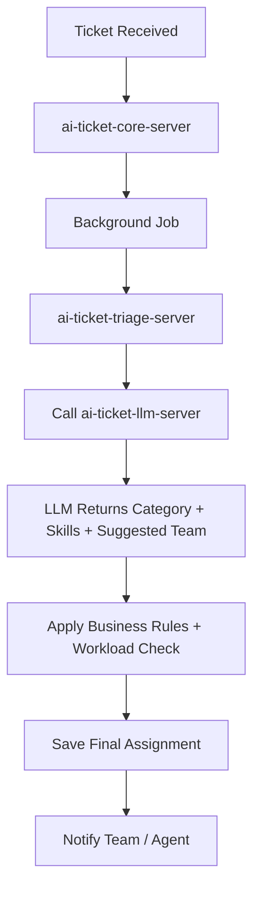

---

```markdown
# Team Assignment Decision Logic

## Overview

The **Team Assignment** module is a core part of the AI Customer Ticket Triage system. It intelligently routes tickets to the most appropriate **support team** (and optionally to a specific agent) using a combination of LLM intelligence and deterministic rules.

**Primary Goal**: Reduce assignment time, balance workload, and increase first-touch resolution rate.

---

## Assignment Strategy

### 1. Two-Level Assignment

| Level              | Priority | Method                          | When Used                     |
|--------------------|----------|---------------------------------|-------------------------------|
| **Team Assignment**    | Primary  | Hybrid (LLM + Rules)            | Every ticket                  |
| **Agent Assignment**   | Secondary| Workload + Skill-based          | High priority or auto-assign  |

**Rule**: Always assign to a **Team** first. Agent assignment is optional and usually done later.

---

## Architecture Flow



---

## Decision Making Process (Hybrid Approach)

### Step-by-step:

1. **LLM Analysis** (`ai-ticket-llm-server`)
   - Analyzes ticket content (subject + message)
   - Extracts: `category`, `requiredSkills`, `sentiment`, `complexity`
   - Suggests initial `suggestedTeam`

2. **Business Rules Engine** (`ai-ticket-triage-server`)
   - Applies deterministic mapping
   - Applies overrides (e.g., VIP customers, specific keywords)
   - Combines with current team workload

3. **Workload Balancer**
   - Considers: Open tickets, SLA risk, Agent expertise, Recent performance

4. **Final Decision**
   - Stores `assignedTeam`, `assignedAgent` (optional), `assignmentMethod`, `assignmentReason`

---

## LLM Prompt Template (Recommended)

**File**: `prompts/team-assignment.prompt.md`

```text
You are an expert support ticket routing assistant.

Available Teams and Responsibilities:
- technical-support → Technical issues, bugs, login problems, product errors
- finance-support → Billing, payments, refunds, invoices, subscriptions
- account-management → Account access, upgrades, cancellations, general inquiries
- product-support → Feature requests, product usage guidance

Ticket Details:
Subject: {{subject}}
Message: {{message}}
Customer Tier: {{customerTier}}
Previous Tickets: {{ticketCount}}

Analyze the ticket and return JSON only:

{
  "category": "billing | technical | account | product | other",
  "requiredSkills": ["refund", "billing", "login", "api"],
  "suggestedTeam": "finance-support | technical-support | ...",
  "confidence": 0.92,
  "assignmentReason": "Clear duplicate charge request. Matches finance team expertise.",
  "escalationNeeded": false
}
```

---

## Data Model (Key Fields)

```prisma
model Ticket {
  id                    String   @id @default(cuid())
  assignedTeam          String?
  assignedAgent         String?  // User ID or email
  assignmentMethod      String   @default("ai_hybrid") // ai_pure, ai_hybrid, manual
  assignmentReason      String?
  assignmentConfidence  Float?
  assignedAt            DateTime?
  
  // Audit
  assignmentHistory     Json[]   // Track overrides
}
```

---

## Advanced Features (Future / Portfolio+)

- **Vector Similarity Routing**: Find similar past tickets and route to the team/agent who resolved them fastest.
- **Skill Matrix Matching**: Agents have skill tags (billing: 95, technical: 80).
- **Dynamic Workload Balancing**: Real-time scoring based on active tickets + SLA pressure.
- **Learning from Overrides**: Track how often agents re-assign tickets and improve rules/prompts.
- **Escalation Rules**: Auto-escalate to senior team if SLA is at risk.

---

## Why Hybrid Approach?

| Approach           | Accuracy | Explainability | Maintenance | Recommendation     |
|--------------------|----------|----------------|-------------|--------------------|
| Pure LLM           | Medium   | Low            | Low         | Not Recommended    |
| Pure Rules         | High     | High           | High        | Too rigid          |
| **Hybrid (LLM+Rules)** | **High** | **High**       | Medium      | **Best Choice**    |

**Benefits of Hybrid**:
- LLM handles natural language understanding
- Rules ensure consistency and business control
- Easy to audit and explain decisions
- Scalable and cost-effective

---

## Monitoring & Observability

- Track **Assignment Accuracy** (override rate)
- Monitor **Average Assignment Time**
- Measure **Team Workload Balance**
- Log all `assignmentReason` for auditing

---

**Document Owner**: Backend Team  
**Version**: 1.0  
**Last Updated**: May 2026

```

---

### How to Use This File

1. Save it as `docs/teamdecide.md` or `architecture/team-assignment.md` in your repository.
2. Link it from your main project README.
3. You can later expand it with actual code examples or prompt files.

---

Would you like me to also generate:
- A detailed prompt file (`team-assignment.prompt.md`)
- The Prisma schema extension
- Routing logic pseudocode / service structure?

Just say the word and I’ll generate it.